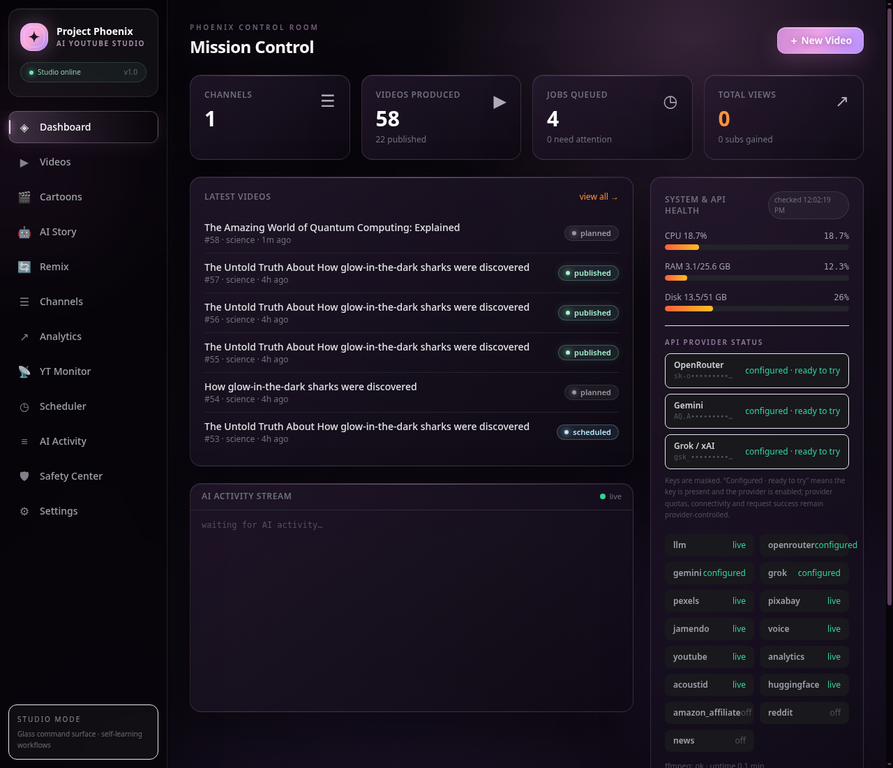

# Project Phoenix AI (v1.4 — monetization phase 1)

An AI-powered YouTube management platform that researches trends, writes scripts,
generates natural voiceovers, collects stock media, selects copyright-safe music,
edits videos, designs thumbnails, optimizes SEO, uploads on a schedule, tracks
analytics and continuously improves its own strategy — for one or many channels,
from a single dashboard.

> **Explicit fallback mode:** every external service degrades gracefully. With zero
> API keys configured, Phoenix can still run the production pipeline with labelled
> template scripts, Edge-TTS voice (free, keyless), procedurally generated
> visuals/music, and dry-run uploads. Analytics are different: synthetic metrics are
> opt-in, and the default live-only mode never presents invented YouTube numbers.

---

## What's new in v1.4 (Phase 1 monetization)

This release adds the 5 most-important features for getting your channel
to the YouTube Partner Program (1,000 subs + 4,000 watch hours):

### New features
- **Pre-upload copyright check (AcoustID)** — fingerprints the rendered
  audio track and looks it up against AcoustID's 200M+ track database
  BEFORE uploading. If a high-score match is found, the video is flagged
  with the matched recording (title / artist / release) so you can swap
  the music before burning an upload quota slot. Requires `fpcalc`
  (chromaprint-tools) + `ACOUSTID_API_KEY`. Falls back gracefully when
  either is missing. (See `services/copyright_check.py`.)
- **AI Thumbnail A/B testing** — generates `THUMBNAIL_VARIANT_COUNT`
  (default 5) visually distinct thumbnail variants per video, then asks
  the LLM to predict a CTR score 0-100 for each based on the title,
  palette, emoji, and text placement. The best-scoring variant becomes
  the active thumbnail. Variants can be regenerated or manually picked
  from the dashboard. (See `services/thumbnail_ai.py`.)
- **First-30-second hook analyzer** — after the script is written, the
  LLM scores the opening scene's hook on 4 dimensions (curiosity,
  clarity, stakes, pacing) — each 0-25, total 0-100. Scores below 60
  trigger a warning + 3 alternative hook lines. The score is stored on
  the Video row (`hook_score`) and displayed as a badge on the video
  card. (See `services/hook_analyzer.py`.)
- **Best upload time AI** — analyzes the channel's historical
  AnalyticsSnapshot data to find the top 3 publish hours per weekday
  based on first-snapshot views. Falls back to the strategy profile's
  publish_hours, then to [13, 17, 21]. Exposed via
  `/api/monetization/upload-times/{channel_id}` and
  `/api/monetization/upload-times/{channel_id}/next`. (See
  `services/upload_time_ai.py`.)
- **Long → Shorts auto-clipper** — after a Long video finishes
  rendering, automatically detects the 3-5 most engaging moments
  (heuristic: voice-density + scene position) and produces portrait
  (9:16) Shorts from them. Each Short is stored as a separate Video row
  linked to the parent via `parent_video_id` + `is_short=True`. Can be
  triggered manually from the video card's "✂ clip Shorts" button. (See
  `services/shorts_clipper.py`.)

### New API keys (all free)
- `ACOUSTID_API_KEY` — https://acoustid.org/api
- `HUGGINGFACE_TOKEN` — https://huggingface.co/settings/tokens
- `AMAZON_AFFILIATE_TAG`, `AMAZON_PA_API_KEY`, `AMAZON_PA_SECRET` — https://affiliate-program.amazon.com/
- `REDDIT_CLIENT_ID`, `REDDIT_SECRET` — https://www.reddit.com/prefs/apps
- `NEWS_API_KEY` — https://newsapi.org/

### New endpoints
- `GET  /api/monetization/upload-times/{channel_id}` — top 3 hours per weekday
- `GET  /api/monetization/upload-times/{channel_id}/next` — single best next hour
- `POST /api/monetization/hook-analyze/{video_id}` — re-run hook analyzer
- `POST /api/monetization/copyright-check/{video_id}` — re-run copyright check
- `GET  /api/monetization/thumbnail-variants/{video_id}` — list A/B variants
- `POST /api/monetization/thumbnail-variants/{video_id}/regenerate` — regenerate
- `POST /api/monetization/thumbnail-variants/{video_id}/pick/{idx}` — pick variant
- `GET  /api/videos/{video_id}/shorts` — list Shorts clipped from a parent
- `POST /api/videos/{video_id}/clip-shorts` — manually trigger Shorts clipping

### New DB columns on `videos`
- `hook_score` (int 0-100)
- `copyright_check_passed` (bool), `copyright_check_score` (float), `copyright_check_meta` (JSON)
- `predicted_ctr` (int 0-100)
- `parent_video_id` (int, nullable — set on Shorts)
- `is_short` (bool, indexed)

### New video statuses
- `short_ready` — a Short has been clipped, awaiting upload decision

### Dashboard changes
- Videos page now shows badges for hook score (🎣), predicted CTR (🎯),
  and copyright check (✓/⚠) on each video card.
- Videos page has a new "✂ clip Shorts" button on long rendered videos.
- Produce form has a new "✂ Auto-clip Shorts after render" toggle
  (only enabled in Long mode).
- Settings page exposes all v1.4 feature flags + shows API availability.

---

## What's new in v1.3

This release adds the most-requested production features: length modes for
Shorts vs Long videos, a YouTube realtime monitor that learns from
top-performing videos, automated copyright-check + auto-publish flow,
cinematic video editing, Urdu voice fix, and a much more powerful
scheduler.

### Bug fixes (v1.3)
- **Urdu speaking/writing unclear** — Edge-TTS was receiving raw Urdu text
  with diacritics, Arabic yeh at word ends, and tatweel that confused the
  tokenizer. Fix: `_normalize_urdu_text()` strips tashkeel, converts Arabic
  yeh to Urdu yeh (ے) at word ends, breaks long sentences at Urdu
  punctuation, and the `pick_voice()` function auto-selects the right
  voice per language (`ur-PK-AsadNeural` for Urdu, `hi-IN-MadhurNeural`
  for Hindi, etc.). When you change the video's language, the TTS voice
  auto-changes — no configuration needed.
- **Green-screen subscribe overlay** — already fixed in v1.2; v1.3 makes
  it a clean styled end-card that's OFF by default, with a small
  persistent "🔔 SUBSCRIBE" badge as an alternative.
- **Settings page only showed values** — already fixed in v1.2; v1.3
  adds the new toggles (cinematic mode, copyright check, monitor
  settings, scheduler auto-trigger, etc.) to the same editable form.

### New features (v1.3)
- **Video length modes** — pick `Shorts` (random 30s–3min, portrait),
  `Long` (random 3–10min, landscape), or `Manual` (exact target seconds)
  per video. The aspect ratio auto-switches to portrait for shorts and
  landscape for long-form. Visible on the Videos page as three big
  buttons above the produce form.
- **YouTube realtime monitor** (new page in the sidebar) — searches
  YouTube for top videos in a niche (filter by 1M / 2M / 5M / 10M+ views),
  fetches full metadata (title, tags, description, statistics, duration),
  caches them in the TrendingVideo table, and asks the LLM to extract
  LearnedInsight rows: hooks, title patterns, tag clusters, description
  patterns, duration bands, takeaways. These insights are fed back into
  the scriptwriter as "inspiration" so new videos draw from proven
  patterns. Supports region codes (US, GB, IN, PK, AE, etc.) and a
  daily quota cap.
- **Scheduled slots** (new scheduler UI) — define per-channel production
  slots with their own time (hour:minute UTC), categories, length mode,
  language, and YouTube category. The scheduler auto-fires each slot at
  its time (if `SCHEDULER_AUTO_TRIGGER=true`). You can also fire any
  slot manually with the "Fire now" button. Slots persist across
  restarts.
- **Copyright check + auto-publish/delete** — when
  `COPYRIGHT_CHECK_ENABLED=true` (default), every real upload goes as
  `unlisted`, waits `COPYRIGHT_WAIT_SECONDS` (default 150s = 2.5min),
  then checks the video for Content ID claims. If a claim is found, the
  video is automatically deleted. If clean, it's switched to
  `POST_CHECK_PRIVACY` (default `unlisted`). Set `AUTO_PUBLISH_AFTER_CHECK=false`
  to leave clean videos as unlisted.
- **Cinematic mode** — when `CINEMATIC_MODE=true` (default), the editor
  applies a stronger color grade (saturation +6%, contrast +6%, slight
  teal-orange LUT), longer 0.6s fades, and 2.35:1 letterbox bars on
  landscape videos. CRF drops to 18 for higher quality. The
  scriptwriter's prompt asks for a movie-like narrative arc with vivid
  cinematic visual queries ("slow drone over desert at dawn" instead of
  "technology cinematic").
- **Professional English SEO** — tags and descriptions are ALWAYS written
  in `SEO_LANGUAGE` (default `en`) regardless of the video's narration
  language, so an Urdu-narrated video still gets English tags for global
  search reach. The channel name is included once in the description and
  added as the first tag. When `HIDE_HOOKS_IN_DESCRIPTION=true` (default),
  the LLM is told to NOT restate the hook line in the description — so
  competitors can't reverse-engineer your retention strategy from the
  public description. Trending keywords from the monitor are merged into
  the tag list.
- **Expanded categories** — 24 niches (was 6): technology, finance,
  health, space, history, science, education, entertainment, gaming,
  lifestyle, news, music, travel, food, fitness, sports, automotive,
  diy, art, business, psychology, philosophy, politics, fashion.
- **Expanded languages** — 16 languages with native scripts in the
  picker (English, Urdu, Hindi, Spanish, Arabic, German, French,
  Portuguese, Turkish, Russian, Indonesian, Japanese, Korean, Chinese,
  Persian). Voice auto-changes when you switch language.
- **Better scheduler dashboard** — shows a flow diagram of the upload
  pipeline (unlisted → wait → check → delete/publish), lists every
  scheduled slot with its categories + length mode + last-fired time,
  and exposes the recurring automation jobs + durable queue.

---

## What's new in v1.2

This release fixes every bug reported in v1.1 and adds the most-requested
features for the automated YouTube upload workflow.

### Bug fixes (v1.2)
- **`ass_path` escaping in `editor.py`** — the FFmpeg `ass=` filter used a path
  that broke on Windows (backslashes) and on paths containing apostrophes /
  colons. Fix: a new `_ass_path_for_filter()` helper converts backslashes to
  forward slashes FIRST, then escapes `:` and `'` in the right order.
- **YouTube Analytics 404 after OAuth** — the `_live()` analytics path raised
  on any HTTP error and the route would bubble that 404 up to the dashboard.
  Fix: 400/404 from the YouTube Analytics API are now treated as "no data yet"
  (channel is new, video just published) and the function returns None so the
  caller falls back to simulated data. The route also auto-refreshes cached
  channel info (name, subscribers, thumbnail) so the dashboard reflects the
  real channel immediately after OAuth consent.
- **YouTube auto-upload silently fell back to dry-run** — when dry-run was OFF
  but no token was cached (OAuth not yet completed), the upload would silently
  produce a manifest instead of telling the user to re-consent. Fix: the
  manifest now carries a `reason: "no_token"` flag and a clear log message so
  the user knows exactly what to do.
- **`scheduler.snapshot()` crashed before start** — calling the dashboard
  summary before the scheduler had computed job next-run times raised
  `AttributeError: 'Job' object has no attribute 'next_run_time'`. Fix: use
  `getattr` with a safe default.
- **Green-screen "Subscribe" end-card** — the old end-card was an
  un-transparent green-screen overlay that flashed "SUBSCRIBE" at the end of
  every video. Replaced with a clean styled end-card (solid pill + outline)
  that is OFF by default and toggleable from the Settings page or per-video.

### New features (v1.2)
- **Editable Settings page** — every relevant setting (channel name, niche,
  language, videos/day, target length, resolution, aspect, privacy, captions,
  watermark, subscribe end-card, subscribe badge, intro/outro, default
  categories, YouTube dry-run, YouTube category, TTS voice/rate/pitch) is now
  editable from the dashboard. Saving writes to `.env` (preserving comments &
  ordering) and applies to the running process instantly. (See
  `frontend/.../SettingsPage.tsx`, `backend/app/api/routes_settings.py`.)
- **Web-based YouTube OAuth flow** — no CLI needed any more. The Channels page
  has a "Connect YouTube" button that opens a Google consent popup; the token
  is exchanged at `/api/oauth/callback` and cached automatically. The dashboard
  polls for connection status so the user sees "✓ connected" without a refresh.
- **Real-time YouTube channel stats** — after OAuth, the Analytics page shows
  live subscriber / video / total-view counts and the channel thumbnail. The
  `/api/analytics/channel/{id}/realtime` endpoint refreshes the cache on each
  call. (See `services/analytics.py:realtime_channel_overview`.)
- **Category multi-select on video creation** — pick one or more niches
  (technology, science, space, history, …) when starting a production. The
  research step restricts topic discovery to those categories. (See
  `ProduceRequest.categories`, `orchestrator._pick_topic`.)
- **Per-video visual overrides** — captions / watermark / subscribe end-card /
  subscribe badge can be turned on, off, or set to "auto" (use global default)
  per video. Three-state toggle UI. (See `ProduceRequest`, `Video` model.)
- **Small persistent Subscribe badge** — instead of a loud end-card, users can
  enable a small unobtrusive "🔔 SUBSCRIBE" pill in the top-right corner shown
  throughout the whole video.
- **YouTube category picker** — when producing a video, the user can pick the
  YouTube category (Education / Science & Tech / People & Blogs / etc.) from a
  live-fetched list (falls back to a built-in catalog when not connected).
- **Channel edit form** — edit name, niche, language, videos/day, privacy from
  the Channels page (no need to edit the database directly).
- **Language override per video** — produce a single video in a different
  language without changing the channel default.
- **Auto-refresh of cached YouTube stats** — the OAuth refresh button pulls
  the latest subscriber / view / video counts and updates the local cache.

---

## What's new in v1.1

This release fixes every bug reported in the v1.0 logs and adds the most-requested
features for the automated YouTube upload workflow.

### Bug fixes
- **`[WinError 2] The system cannot find the file specified`** — the most
  critical crash, which killed every render at the voice stage. Root cause:
  `asyncio.create_subprocess_exec` could not resolve `ffmpeg` / `ffprobe` on
  Windows when they were on `PATH` but not in the current directory. Fix: all
  subprocess calls now resolve the binary to an absolute path first via
  `shutil.which` (+ `.exe` fallback on Windows). A new `ffmpeg_bin()` helper is
  used everywhere ffmpeg is invoked (`voice`, `editor`, `media`, `music`,
  `thumbnail`). (See `backend/app/core/utils.py`.)
- **YouTube OAuth `client_secret.json` not found** — the previous code used a
  raw path that broke on Android (`/storage/emulated/0/Download/...`) and on any
  setup where the working directory wasn't the project root. Fix: paths are now
  resolved against the project root via `settings.path(...)`; absolute paths
  are honored as-is; a clear error message tells the user where to drop the
  file. (See `backend/app/services/uploader.py`.)
- **ECONNREFUSED on the Vite dev server** — caused by the FastAPI backend
  crashing on boot (see above) so the dashboard had nothing to proxy to. With
  the subprocess fix, the backend now starts cleanly and serves every endpoint.
- **Edge-TTS hard failure on offline / DNS-blocked hosts** — added a third
  fallback tier: if Edge-TTS fails AND ffmpeg is missing, Phoenix now writes a
  pure-Python WAV (no dependencies), so a render never hard-fails on voice.
  (See `backend/app/services/voice.py`.)
- **LLM providers silently returning HTTP 4xx** — Gemini's `gemini-1.5-flash`
  and xAI's `grok-2-latest` are both deprecated by their providers and now
  return 404 / 400. Updated defaults to `gemini-2.0-flash` and `grok-beta`.
  Provider responses are now parsed for status code and a clear warning is
  logged before falling back to the next provider. (See
  `backend/app/services/llm.py`.)
- **SQLite JSON-path query crashes** — `Job.payload["channel_id"].as_integer()`
  is not supported by SQLite's JSON implementation, which crashed
  `daily_production` and `recover_interrupted_work`. Replaced with a
  Python-side filter that is database-agnostic. (See
  `backend/app/pipeline/scheduler.py` and `recovery.py`.)
- **Scheduler `pause`/`resume` crashed when not running** — fixed state
  transitions and added a graceful `start()` no-op when already running.
- **Environment variable leak from parent project** — when Phoenix runs inside
  another project that has its own `.env` (e.g. `DATABASE_URL=file:...`), the
  parent's value would leak in and break SQLAlchemy. Fix: Phoenix now force-
  loads its own `.env` into the process environment before constructing
  Settings. (See `backend/app/config.py`.)

### New features
- **Video size & aspect selector** — pick `480p / 720p / 1080p / 1440p / 4k`
  AND `landscape (16:9) / square (1:1) / portrait (9:16)` per production.
  Portrait = Shorts / Reels / TikTok. Exposed in the dashboard "Produce a
  video" form under *Advanced options*. (See `backend/app/config.py`,
  `schemas.py`, `routes_videos.py`, `frontend/.../VideosPage.tsx`.)
- **Target length selector** — 30 s to 10 min presets (in addition to the
  `.env` default) so each video can have its own duration.
- **Auto-detect YouTube channel name** — after the first OAuth consent, the
  uploader calls `youtube.channels.list(part=snippet, mine=true)` and
  persists the real channel title + id on the local `Channel` row. No manual
  configuration needed. Also exposed as a manual "📺 detect YT name" button on
  each channel card. (See `backend/app/services/uploader.py` and
  `routes_channels.py`.)
- **Pure-Python silent / tone WAV fallback** — the voice pipeline can now
  produce a usable audio track with zero external tools, so Phoenix runs even
  on a stripped-down machine without ffmpeg or internet.
- **`.env.example`** — a clean template with all options documented.
- **Cross-platform `run.sh`** — handles Git-bash on Windows, warns clearly
  when ffmpeg is missing, and uses `setsid`/`disown` so the backend survives
  the parent shell exiting.

---

## 1. Requirements

| Tool | Version | Notes |
|------|---------|-------|
| Python | 3.10+ | backend |
| FFmpeg | 5+ | must be on `PATH` (`ffmpeg -version` to check). Optional in mock mode. |
| Node.js | 18+ | dashboard only |

## 2. Quick start

The recommended path is now a single command. It creates the Python environment,
installs only changed dependencies, installs/builds the dashboard from the lockfile,
and starts the API, scheduler, and built dashboard on one port:

```bash
cd project-phoenix-ai
./run.sh
```

Open <http://localhost:8000> for the dashboard and <http://localhost:8000/docs> for
API documentation. The launcher is idempotent: if the API is already healthy, a
second invocation reports the existing URL instead of starting a duplicate process.

For an intentionally isolated smoke test, use the labelled demo command:

```bash
python backend/cli.py demo
```

The demo may use generated/template content, but the normal analytics tracker is
**live-only by default**. It does not invent views, subscribers, retention, or
revenue metrics when YouTube data is unavailable.

## 3. Connecting your accounts

### LLM keys (research / scripts / SEO)
Set at least one of `OPENROUTER_API_KEY`, `GEMINI_API_KEY`, or `GROK_API_KEY` in
`.env`. Phoenix tries them in that order, retries transient failures with
exponential backoff, and can try comma-separated OpenRouter model fallbacks from
`OPENROUTER_FALLBACK_MODELS`.

No provider can honestly guarantee unlimited usage. OpenRouter usage remains
subject to the account balance, per-key limits, model/provider capacity, and free
model request caps. Phoenix therefore reports provider availability truthfully and
falls back to the next configured provider or a clearly labelled template engine;
it never labels generated placeholders as real analytics.

Recommended configurable defaults:
- OpenRouter: `meta-llama/llama-3.1-8b-instruct`
- Gemini: `gemini-2.0-flash`
- Grok: `grok-2-latest`

### Pexels / Pixabay
Free keys: <https://www.pexels.com/api/> and <https://pixabay.com/api/docs/>.
Without them, Phoenix generates animated branded background clips locally.

### Jamendo (music)
Register a free developer app at <https://devportal.jamendo.com/> → set
`JAMENDO_CLIENT_ID`. Without it, Phoenix synthesizes neutral ambient beds locally.

### YouTube (OAuth)
1. Google Cloud Console → create a project → enable **YouTube Data API v3** and
   **YouTube Analytics API**.
2. Create OAuth credentials (type **Web application**), add
   `http://localhost:8000/api/oauth/callback` to the *Authorized redirect URIs*,
   download the JSON, save it to `secrets/client_secret.json`.
3. Keep `YOUTUBE_DRY_RUN=true` until you have watched one full render and are happy.
4. **Two ways to connect:**
   - **From the dashboard** (recommended): open the Channels page, click
     "🔗 Connect YouTube" — a Google consent popup opens, you sign in, and the
     token is cached automatically. The dashboard polls for connection status.
   - **From the CLI**: `python backend/cli.py auth` opens a local server on
     port 8765 that Google redirects back to.
5. After consent, Phoenix auto-detects your **real YouTube channel name,
   subscriber count, video count, view count, country, and thumbnail** and
   caches them on the local Channel row.
6. When you're ready to upload for real, go to the Settings page and toggle
   **YouTube dry-run mode** OFF. (Or set `YOUTUBE_DRY_RUN=false` in `.env`.)
7. Upload quota note: the default YouTube API quota (10,000 units/day) allows about
   **6 uploads/day** (1,600 units each) — 3/day fits comfortably. Request a quota
   increase if you scale channels.

### Voice
Edge-TTS needs **no key**. Change `TTS_VOICE` to any voice from
`edge-tts --list-voices` (100+ locales, many styles). When Edge-TTS is
unreachable, Phoenix falls back to ffmpeg synth, then to a pure-Python WAV.

## 4. How the system fits together

```
            ┌──────────────────────── DASHBOARD (React) ─────────────────────────┐
            │  stats · queue · logs (WS) · analytics · scheduler · API health    │
            │  per-video: resolution + aspect + length + topic picker            │
            └──────────────────────────────▲─────────────────────────────────────┘
                                           │ REST / WebSocket
   ┌───────────────────────────────────────┴─────────────────────────────────────┐
   │                         FastAPI app  (backend/app)                          │
   │  api routes ──▶ pipeline/orchestrator ──▶ services                          │
   │       │                 │                                                   │
   │  pipeline/scheduler     ├─ research  → trends, niches, competitors          │
   │  (APScheduler, SQLite   ├─ scriptwriter → hooks, scenes, retention arcs     │
   │   jobstore, crash       ├─ voice → Edge-TTS (+word timings for captions)    │
   │   recovery on boot)     ├─ media → Pexels/Pixabay (+generated fallback)     │
   │                         ├─ music → Jamendo mood match (+synth fallback)     │
   │                         ├─ editor → FFmpeg: cuts, fades, zoom-pan, color,   │
   │                         │   music ducking, styled captions, watermark       │
   │                         ├─ thumbnail → 3 high-CTR variations (Pillow)       │
   │                         ├─ seo → title/description/tags/chapters            │
   │                         ├─ uploader → resumable upload + scheduling +       │
   │                         │   auto-detect YouTube channel name                │
   │                         ├─ analytics → views/retention/CTR/subscribers      │
   │                         └─ learning → strategy weights fed back upstream    │
   └─────────────────────────────────────────────────────────────────────────────┘
```

### The self-learning loop
Every video stores its strategy context (niche, hook style, title pattern, publish
hour). Nightly, `services/learning.py` compares each video's CTR/retention/views
against the channel baseline, rewards winners and penalizes losers in the
`StrategyProfile` table, and that profile steers the *next* day's research,
script prompts and schedule. Insights are visible in the dashboard.

## 5. Operating it

```bash
python backend/cli.py serve          # API + scheduler daemon (run 24/7)
python backend/cli.py run-once       # produce & upload one video now
python backend/cli.py research       # run today's trend research only
python backend/cli.py status         # queue / system health summary
python backend/cli.py auth           # complete YouTube OAuth consent
python backend/cli.py demo           # one short mock video, safe anywhere
```

The scheduler runs daily research (06:00), produces `VIDEOS_PER_DAY` videos at the
channel's optimized publish hours, syncs analytics every 6 h, and updates the
learning profile nightly. On boot, interrupted renders/uploads are detected and
re-queued automatically. Every job retries with exponential backoff.

### Per-video overrides (new)
The dashboard *Produce a video* form now exposes:
- **Resolution** — 480p / 720p / 1080p / 1440p / 4k
- **Aspect ratio** — landscape (16:9 long-form) / square (1:1 feed) /
  portrait (9:16 Shorts / Reels / TikTok)
- **Target length** — 30 s / 1 m / 2 m / 3 m / 5 m / 10 m

These are passed to the API and override the `.env` defaults for that one video.

## 6. Safety & platform-compliance notes (read once)

**Tracking truthfulness:** `ALLOW_SIMULATED_METRICS=false` is the default. Set it to
`true` only for an explicit demo or test run; the dashboard labels those snapshots
as `simulated`. Keep YouTube OAuth connected and dry-run disabled only when you
intend to read or upload against a real channel.


- Start with `VIDEO_PRIVACY=private` and `YOUTUBE_DRY_RUN=true`; review outputs,
  then switch to `unlisted`, then `public`.
- YouTube monetization policies penalize "mass-produced / repetitious" content.
  Phoenix's quality levers (real narration, scene-level media matching, learning
  loop) exist to keep content original — use them, and keep a human review step
  for the first weeks.
- Only upload media you have rights to: Pexels/Pixabay licenses and Jamendo's
  royalty-free catalog are safe defaults; the `VIDEO_PRIVACY` staging flow keeps
  you in control.

## 7. Project layout

```
backend/app/
  config.py           settings (env-driven, mock auto-detection, resolution/aspect)
  database.py         engine/session; models.py all SQLAlchemy tables
  services/           llm research scriptwriter voice media music editor
                      thumbnail seo uploader analytics learning health
  pipeline/           orchestrator (end-to-end), scheduler, recovery
  api/                REST routes + websocket logs
  core/utils.py       cross-platform subprocess + ffmpeg/ffprobe resolution
backend/cli.py        operate everything from the terminal
frontend/             React + Vite + Tailwind dashboard
data/                 media cache, renders, thumbnails, tokens, logs, sqlite db
assets/               fonts, optional logo.png / intro.mp4 / outro.mp4
secrets/              client_secret.json (YouTube OAuth)
.env / .env.example   configuration
run.sh                one-shot launcher (cross-platform)
```

## 8. Extending it

- New LLM provider → add a branch in `services/llm.py` (OpenAI-compatible shape).
- New stock source → implement `search_videos()` in `services/media.py` style.
- Real motion graphics → the editor is plain FFmpeg filter graphs; drop in
  `assets/intro.mp4`, `assets/logo.png` and they're picked up automatically.
- Multi-channel → create channels in the dashboard; every channel has independent
  schedule, strategy profile, analytics and token.


## Production Safety Pack

The Safety Center is available at `/safety` and provides a human approval queue, a 31-day content calendar view, a durable error center, safe database backups, restore confirmation, notification logs, and honest local quota accounting. When `APPROVAL_REQUIRED=true` and live YouTube publishing is enabled, a rendered video is held at `awaiting_review` until a reviewer approves it from the Safety Center. Dry-run mode remains available for safe testing.

The backup system stores a timestamped SQLite snapshot and manifest while deliberately excluding `.env`, OAuth tokens, and secrets. Restoring requires an explicit confirmation request and preserves a pre-restore database copy. Provider-side YouTube and OpenRouter balances are never fabricated; the quota panel labels them as unknown unless an official provider balance is available.

Relevant endpoints include `GET /api/safety/summary`, `GET /api/safety/review-queue`, `POST /api/safety/review/{video_id}`, `GET /api/safety/calendar`, `GET /api/safety/errors`, `GET|POST /api/safety/backups`, `POST /api/safety/backups/{name}/restore`, `GET /api/safety/notifications`, and `GET /api/safety/quota`.

The production dashboard is an SPA, so direct URLs such as `/safety`, `/analytics`, and `/settings` are served through the frontend fallback. Run the whole stack with one command:

```bash
./run.sh
```

Safety Pack regression checks can be run with:

```bash
python backend/test_safety_pack.py
```


## Full Section Quality Audit

The latest audit covers every dashboard page and the long-form, Shorts, Cartoon, AI Story, Remix, Safety, Scheduler, Analytics, Monitor, Channels, Logs, and Settings workflows. The audit added `backend/test_media_sections.py` for real 9:16 MP4 validation, deterministic AI Story FFmpeg assembly, target-duration word scaling, metadata fallback, and the special-flow approval gate. `backend/test_all_sections.py` checks all direct SPA pages and core APIs, including honest Remix behavior when Whisper is unavailable.

The current code does not claim live provider behavior without credentials. YouTube remains dry-run until OAuth is connected; analytics remain live-only; AI falls back to labelled templates when no provider is configured; and Remix requires Whisper or faster-Whisper for transcript extraction. Historical failed jobs and older short-duration videos remain visible as historical records rather than being silently rewritten.


## Premium Glass Studio UI and Upload Policy Modes

The dashboard now uses a custom dark glassmorphism system inspired by the supplied visual direction: black-to-plum canvas, pink/lilac/violet ambient lighting, translucent frosted cards, luminous borders, pill badges, animated buttons, focus states, and reduced-motion support. The reference was used only as visual direction; Phoenix retains its own navigation, workflow labels, and YouTube-specific functionality.

Settings now exposes two explicit live publish modes through the Production Safety Pack card. **Manual approval** keeps rendered videos in Safety Center until the user approves them. **Automatic safe upload** skips the human review step but still respects dry-run, OAuth availability, copyright checks, privacy settings, provider limits, and YouTube safety constraints. The current mode is also shown in the Videos form and Safety Center so the behavior is never ambiguous.


## 9. Runtime folders and private files

The distribution keeps the runtime folders visible even before the first video is created. The important paths are `data/uploads/` for browser-uploaded source videos, `data/cartoons/` for Cartoon download staging, `data/output/` for final MP4 files and per-job working folders, `data/media/` for reusable media, `data/music/` for background music, `data/thumbnails/` for thumbnails, `data/logs/` for application logs, `data/backups/` for Safety Pack snapshots, and `data/tokens/` for private YouTube OAuth tokens. These directories contain `.gitkeep` markers; generated contents remain ignored.

For YouTube authorization, copy the private Google OAuth Desktop/Web credentials file to `secrets/client_secret.json`. The package includes `secrets/client_secret.json.example` as a safe shape-only template. Never rename the example over the real credential file, and never publish the real JSON or token files. The launcher checks this exact path and prints a clear warning when it is missing.

The public/sanitized distribution intentionally excludes `.env`, `secrets/client_secret.json`, database files, generated media, logs, and token files. A separate private complete bundle can contain the user's original credentials, but that archive must be treated as confidential and must not be uploaded to a public repository.

The launcher creates missing runtime folders automatically on every start:

```bash
./run.sh
```

It also creates `.env` from `.env.example` when needed, checks FFmpeg, faster-whisper, yt-dlp and fpcalc, preserves the one-port API/dashboard startup, and exits cleanly when Phoenix is already running.


## 10. Complete API and Google OAuth setup guide

Roman Urdu mein complete setup instructions alag file mein di gayi hain:

> **[API_SETUP_GUIDE_ROMAN_URDU.md](API_SETUP_GUIDE_ROMAN_URDU.md)**

Is guide mein Google Cloud project، YouTube Data API v3، YouTube Analytics API، OAuth consent screen، test user email، exact scopes، Web/Installed `client_secret.json` shapes، redirect URI، OpenRouter، Gemini، Grok/xAI، Pexels، Pixabay، Jamendo، `.env` mapping، optional services، security aur common errors sab step-by-step explain kiye gaye hain.

Core setup ke liye pehle Google OAuth + YouTube Data/Analytics APIs، phir OpenRouter configure karein۔ Gemini aur Grok fallback providers hain؛ Pexels، Pixabay aur Jamendo useful optional services hain۔ Amazon، Reddit، NewsAPI اور doosri integrations ko initial setup mein blank chhora ja sakta hai۔


## Long-video quality and Urdu voice

Long-form videos ab final MP4 artifact ko `ffprobe` se measure karte hain۔ Requested `VIDEO_TARGET_SECONDS` ke against measured duration compare hoti hai؛ default allowed difference `max(3 seconds, 8%)` hai۔ Agar video is range se chhoti ya zyada ho to pipeline misleading success nahi dikhati، balkay clear duration-verification error log karti hai۔

Script fallback ab target duration ke mutabiq spoken-word budget use karta hai، non-explainer formats ko bhi expand karta hai، aur script object mein `purpose` aur `takeaways` fields save karta hai۔ Is se video sirf filler scenes ka collection nahi rehta؛ viewer ko context، samajh aur actionable takeaway milta hai۔

Urdu videos ke liye automatic voice `ur-PK-AsadNeural` select hoti hai۔ Urdu narration ke liye default rate `URDU_TTS_RATE=-8%` hai taa-ke pronunciation aur pauses zyada clear hon۔ Is value ko `.env` mein change kiya ja sakta hai۔ Focused verification command:

```bash
python backend/test_long_video_quality.py
```

Is test mein final MP4 duration، Urdu voice mapping، Urdu text normalization، purpose metadata aur long-form script scaling verify hote hain۔


## Automatic workflow mode

Fresh installations ab automatic safe-upload mode se start hoti hain: `APPROVAL_REQUIRED=false`۔ Is mode mein script، voice، media، duration verification، metadata، thumbnail، copyright check، scheduler aur upload pipeline khud chalti hai۔ Manual approval sirf tab enable karein jab Safety Center mein review karna ho۔

Automatic mode ka matlab unsafe blind upload nahi hai۔ OAuth missing ho، `YOUTUBE_DRY_RUN=true` ho، final artifact missing/corrupt ho، final duration tolerance se bahar ho، copyright/policy check fail ho، provider quota/rate limit active ho، ya upload API error de، to system publish rokta hai، error/audit record save karta hai اور retry/resume ya notification path use karta hai۔ Real YouTube publishing ke liye OAuth complete karke hi `YOUTUBE_DRY_RUN=false` set karein۔


## New automatic research, usage and long-video verification

### Real 10–20 minute long-video verification

The explicit verifier never uploads. It produces a real long-form artifact, measures the final MP4 with `ffprobe`, checks video/audio streams, checks the duration tolerance, checks purpose/takeaway metadata and prints a JSON quality report. It intentionally consumes real CPU, disk and configured provider requests, so it is not run automatically on every startup.

```bash
python backend/cli.py verify-long --seconds 600 --topic "Your detailed topic"
```

Use `--seconds 1200` for a 20-minute verification. Valid values are 600–1200 seconds. Exit code `0` means the final artifact passed; exit code `2` means the quality gate blocked it. The command always uses `publish=False`.

### Automatic topic research

The Monitor page now has **Automatic topic research**. The backend prefers available real signals from Google Trends, public Reddit trend reads, optional NewsAPI and a connected YouTube channel. Every topic carries `source`, `data_quality` and `score_basis`. If no live source is available, the response is explicitly marked `template_fallback_not_live_trend`; it is never displayed as real trend data.

The API endpoints are:

```text
POST /api/monitor/research/{channel_id}?limit=10
GET  /api/monitor/research/latest/{channel_id}
```

Google Trends support uses `pytrends`; run `./run.sh` after extracting the package so the dependency is installed. Google Trends or Reddit rate limits can still make a source unavailable, in which case the truthful labelled fallback remains active.

### Actual provider usage and cost reporting

The Safety Center now records provider response metadata for OpenRouter, Gemini and Grok. It stores request count, prompt/completion/total tokens and cost only when the provider response reports a cost. Provider balances are always shown as unknown unless an official provider balance endpoint is queried; Phoenix never estimates a price or invents remaining credits.

```text
GET /api/safety/provider-usage?days=1
```

The dashboard distinguishes local YouTube quota accounting, provider-reported cost and unknown provider balance. No configured API key means no provider request usage is recorded.


## Safe API-key import and missing-key diagnosis

Phoenix reads provider credentials from the project-root `.env` file beside `run.sh`, not from `frontend/.env` or `.env.example`. The dashboard deliberately shows `not configured`/mock when the backend process receives an empty value. Raw keys are never printed.

To merge a real local environment file without allowing blank values to erase existing credentials, use:

```bash
python backend/cli.py import-env /path/to/your/.env
./run.sh
```

The command imports only non-empty settings, requires at least one non-empty provider key, creates a timestamped backup of the current `.env`, and blocks an empty or redacted source file. The launcher now prints provider names only, with values hidden. If it reports `no non-empty provider API keys found`, the dashboard will correctly remain in mock/not-configured mode.

Required provider names are `OPENROUTER_API_KEY`, `GEMINI_API_KEY`, `GROK_API_KEY`, `PEXELS_API_KEY`, `PIXABAY_API_KEY` and `JAMENDO_CLIENT_ID`. After changing `.env`, restart the backend; a running process does not automatically reload credentials.


## GitHub clone and Windows startup

The complete English startup guide is in [`GITHUB_RUN_COMMANDS.md`](GITHUB_RUN_COMMANDS.md). The recommended single-port startup is `cd project-phoenix-ai` followed by `./run.sh` in Git Bash or WSL. For the requested two-terminal developer mode, Terminal 1 runs the Python backend and Terminal 2 runs `npm install` plus `npm run dev` from the frontend directory. The exact command blocks are preserved in the guide.



The screenshot above shows the dashboard's masked OpenRouter, Gemini, and Grok/xAI status cards. Real `.env` and `secrets/client_secret.json` files must never be uploaded to GitHub. Keep `.env` in the project root and use `python backend\\cli.py import-env C:\\path\\to\\your\\.env` to merge a local environment file safely.
